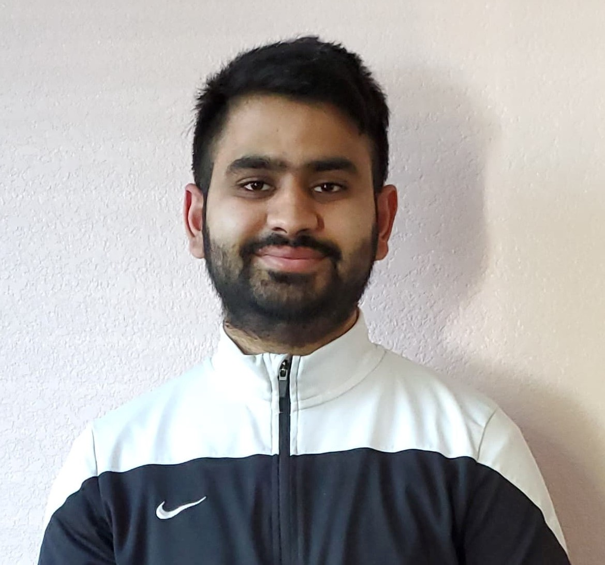

# Hi there! My name is [Reshab Mehta](https://github.com/Reshab18/AboutPage/blob/main/Images/pic.jpg?raw=true)

## Quick links to content on the page
- [Introduction](https://github.com/Reshab18/AboutPage/blob/main/index.md#introduction)
- [Hobbies](https://github.com/Reshab18/AboutPage/blob/main/index.md#hobbies)
- [Social Media](https://github.com/Reshab18/AboutPage/blob/main/index.md#social-media)
- [Degree Course Requirements](https://github.com/Reshab18/AboutPage/blob/main/index.md#degree-course-requirements) 



## Introduction 
I am a senior at the University of California, San Diego ([UCSD](https://ucsd.edu/)) pursuing a Bachelor’s degree in ***Mathematics-Computer Science***. 
My goal is to become a full-stack software developer. I have not done any internships in the field of ***Computer Science*** 
but I do have educational experience in various programming languages such as **_C++, Python, Java,_ and _System Verilog_**. 
In addition, I am great at optimization, problem-solving, and data structures. Outside of my field of study, I am 
interested in learning about real estate and stocks. My favorite destination spot is [Paris](Images/Destination.jfif).

My favorite quote is by **Bernard M. Baruch**
> ***Be who you are and say what you feel, because those who mind don't matter, and those who matter don't mind.***

Some basic Git commands are:
```
git status
git add
git commit
```

## Hobbies
- Chess  
- Basketball
- Badminton
- Online Gaming
- Sleeping

## Social Media
1. [Facebook](https://www.facebook.com/rishab.mehta182000/)
2. [LinkedIn](https://www.linkedin.com/in/reshab-mehta-78b9381a3/)

## Degree Course Requirements 
### Lower Divison
- [X] Math18
- [x] Math 20A-B-C-D-E
- [X] CSE 11 
- [X] CSE 15L
- [X] CSE 30
- [X] CSE 12

### Upper Division
- [X] Math 109
- [ ] Math 103A-B
- [ ] Math 154
- [ ] MATH 170A-B
- [ ] MATH 140A-B
- [ ] MATH 183 OR MATH 180A
- [ ] CSE 105 
- [ ] CSE 101
- [X] CSE 100
- [ ] CSE 110
- [X] CSE 140
- [X] CSE 140L
